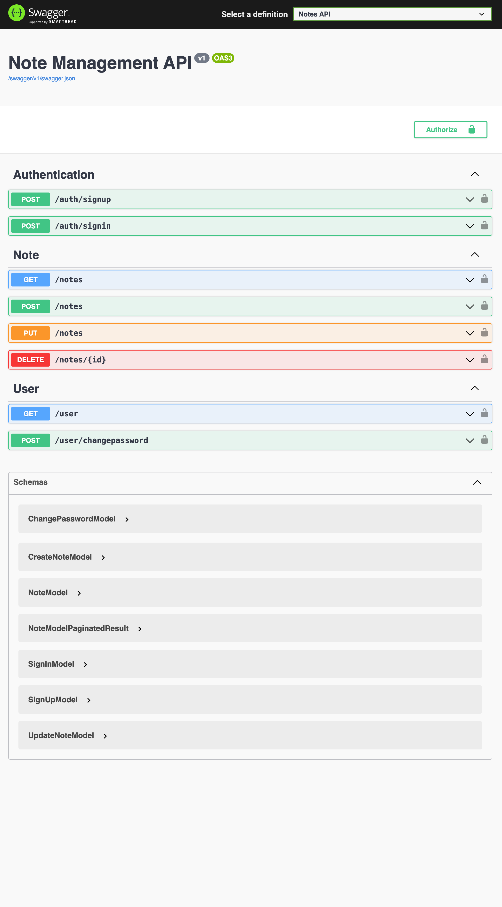

# Restful API example: User notes management.

### What is this repository for? ###

* The project is an example of REST API based on .NET 5.
* If you want to become familiar with .NET it is the good point to start.
* The API is providing simple user JWT authorization.
* User can manage own notes: Create, Update, Delete, Search.
* User note entity consists of the following properties:
    - Text
    - Title
    - Tags

### Tech stack and libraries ####

 * .NET 5
 * Entity Framework Core 5
 * Entity Framework PostgreSQL 
 * Automapper
 * FluentValidation
 * Identity Model JWT
 * Swagger
 * Docker

### Testing tools ####

 * AutoFixture
 * Moq
 * Nunit
 * Entity Framework InMemory Database

### How do I get set up? ###

 1. Install .NET 5 on you local machine
 2. Create and connect to PostgreeSQL database server.
 3. Fill a valid database credentials in:
    ```notes.data/appsettings.json```
    ```notes.api/appsettings.json```
 4. Start command line and navigate to ```src``` folder.
 5. Initialize database scheme by running:
    ```dotnet ef database update --project notes.data```
 5. Start the project:
    ```dotnet run --project notes.api```

### Sample Usage ###
 1. Navigate to in the browser:
   ```https://localhost:5001/swagger/index.html```
 2. Try ```auth/signup``` out with sample credentials.
 3. After success response on 2 try ```auth/signin``` with the data from step 2. You should get ```token``` value in the response
 5. Click ```Authorize``` with the value: 'Bearer ```token```'
 6. Try GET POST PUT DELETE `/notes` endpoints.

### Deployment to the cloud ###
Maybe you wish to deploy this app the the cloud. One of easy and free option can be using the heroku provider. To do that:
 1. Get an heroku account, and create an application.
 2. Install Heroku CLI.
 3. Navigate to ```src``` folder.
 4. Login to heroku.
  ```heroku container:login```
 5. Build and push docker container to the heroku server.
  ```heroku container:push -a notes-api web```
      > ```notes-api``` is the name of the app in the heroku, please change it.
 6. Finally release the container by running.
  ```heroku container:release -a notes-api web```
    > ```notes-api``` is the name of the app in the heroku, please change it.

###
  The last line of ```DOCKERFILE```  is needed for runing in heroku environment:
  ```CMD ASPNETCORE_URLS=http://*:$PORT dotnet notes.api.dll```
 if you deploy to the other place you can replace this to:
  ```ENTRYPOINT ["dotnet", "notes.api.dll"]```
---
### Screenshot ###
